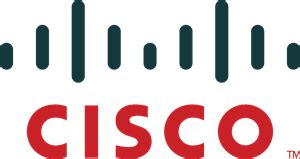
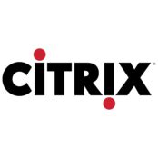

# Training

## PAN-OS

* [Security Policy Rules](./palo/security-policy.md)

---

## ASA

* [Configuring IP Addressing on ASA](./#)
* [Defining nameif and security levels on ASA](./#)
* [Configuring Management access on ASA](./#)
* [Understanding ACL's on ASA](./#)
* [NAT on ASA](./#)
* [Deep Inspection on ASA](./#)
* [Transparent Firewall](./#)
* [Multi-Context](./#)
* [Active/Standby Failover](./#)
* [Active/Active Failover](./#)
* [Clustering Individual Versus Spaned](./#)

---

## Netscaler SDX

* [RHI](./citrix/RHI.md)