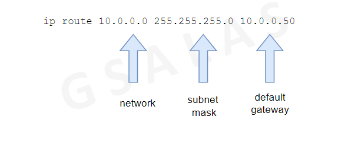
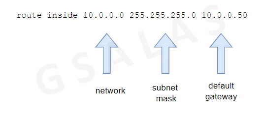

# ASA Firewall

## Table of Content

* Configuring IP Addressing on ASA
* Defining nameif and security levels on ASA
* Configuring Management access on ASA
* Understanding ACL's on ASA
* NAT on ASA
* Deep Inspection on ASA
* Transparent Firewall
* Multi-Context
* Active/Standby Failover
* Active/Active Failover
* Clustering Individual Versus Spaned


## Defining nameif and security levels on ASA

### Configuring IP Addressing on ASA

```
> enable
# show interface ip brief
```

```
# configure terminal
(config)# interface g0/0
(config-if)# ip address 10.0.0.1 255.255.255.0
(config-if)# no shut
```

### Nameif Considerations

Every interface must have *nameif* defined. It must be unique on every interface, and is is also case-sensitive.

### Security levels on the firewall

* Allows the firewall to pass traffic from trusted network to untrusted network.
* Deny's traffic from untrusted network to trusted network by default, without an ACL.
* Ranges from 0 to 100. 0 being the lowest and 100 being the highest.
* Always assign the security level 100 to the interface facing the trusted network.
* Always assign the security level 0 to the interface facing the untrusted network.

## Routing Protocols

Configuring Static Routes on the firewall is somewhat similar to configuring static routes on a Cisco router or switch, with some small differences.

#### Static Route example for a Router or Switch



#### Static Route example for a Firewall



Notice the *nameif* in the statement

---

## Configuring EIGRP on ASA

Configuring EIGRP on the firewall is similar to configuring EIGRP on a Cisco Router, with a few changes. Things to consider before implementing EIGRP

* What Autonomous System is the neighbor using?
* What are the K-values?
* Are we doing any authentication?
* Is my neighbor in the same subnet?

Common troubleshooting commands on the ASA

* show eigrp neighbors
* debug eigrp packets
* show eigrp topology

Configuring EIGRP on the firewall

```
>
> enable
# configure terminal
(config)# router eigrp 100
(config-router)# network 10.0.0.0 255.255.255.0
(config-router)# network 192.168.10.0
```

### Validations

> show eipgr neighbors

> show route inside

### Control Plane Authentication in EIGRP on ASA

* Cisco Routers support two authentication methods:
    + *MD5*
    + *Hmac-sha-256*
* ASA **only** supports MD5
* For MD5, we need to create a Key Chain and apply the Key Chain to the interface of the Cisco Router
* On ASA, we do not need to create a Key Chain
* For *hmac-sha-256*, we do not need a Key Chain, instead, directly define the password on the interface. However, is it only supported in Named mode EIGRP.

```
R1(config)# do sh run | s key chain
key chain R1MD5
 key 1
  key-string cisco

R1# sh run int g0/0
Building configuration...

Current configuration: 179 bytes
!
interface GigabitEthernet0/0
 ip address 10.0.0.1 255.255.255.0
 ip authentication mode eigrp 100 md5
 ip authentication key-chain eigrp 100 R1MD5
```

Configuring MD5 Authentication on ASA

```
ASAx1(config)# sh run interface g0/1
!
interface GigabitEthernet0/1
 nameif inside
 security-level 100
 ip address 10.0.0.50 255.255.255.0
 authentication key eigrp 100 ***** key-id 1
 authentication mode eigrp 1000 md5
```

* Configuring OSPF on an ASA firewall is similar to configuring OSPF on a Cisco Router
* Pre-requisites for OSPF neighborship between two devices:
    + They must be in the same network
    + They must be in the same Area
    + They must have the same MTU
    + They must have the same Hello and Dead timers
    + They must have the same Network Type
    + They must have the same Stub Flag
* Process-ID does not need to match. It is locally significant
* You can activate OSPF under the process using the **network** statement or under the interface using the **ip ospf 1 area 0** command.

Configuring OSPF on Cisco Routers

```
R1# sh run | s r o
router ospf 1
 network 10.0.0.0 0.0.0.255 area 0
 network 150.1.1.1 0.0.0.0 area 0
```

```
R1#sh run int lo0
Building Configuration...

Current configurations: 81 bytes
!
interface Loopback0
ip address 1.1.1.1 255.255.255.255
ip ospf 1 area 0
```

Configuring OSPF on ASA

````
ASAx1(config)# sh run router
router ospf 1
    network 10.0.0.0 255.255.255.0 area 0
    network 150.11.11.1 255.255.255.255 area 0
```

---

[🔙 Back](../README.md)
